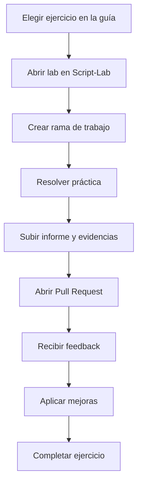

# Dinámica de ramificación y feedback

## Objetivo

Usar GitHub como sistema de práctica, entrega y revisión.

---

## Flujo recomendado



---

## Convención de ramas

```text
lab/<id-ejercicio>/<nombre>
```

Ejemplos:

```text
lab/gt-lab-01-terminal/ana
lab/gt-lab-02-linux/david
lab/gt-lab-07-proyecto/laura
```

---

## Convención de commits

| Tipo | Ejemplo |
|---|---|
| Inicio | `inicia lab 01 terminal` |
| Evidencias | `añade evidencias del diagnostico` |
| Informe | `completa informe del lab` |
| Corrección | `corrige feedback sobre DNS` |
| Mejora | `añade propuesta de automatizacion` |

---

## Plantilla de Pull Request

```md
# Entrega de laboratorio

## Ejercicio

ID:
Nombre:

## Qué se ha realizado

-
-
-

## Evidencias

-
-
-

## Problemas encontrados

-

## Preguntas respondidas

-

## Mejora propuesta

-

## Checklist

- [ ] Informe incluido
- [ ] Evidencias incluidas
- [ ] Preguntas respondidas
- [ ] Checklist del lab completado
- [ ] Mejora propuesta
```

---

## Feedback docente

El feedback debe ser concreto y accionable.

### Ejemplo de feedback útil

```text
Buen diagnóstico inicial. Falta justificar por qué descartas DNS. Añade una prueba de resolución de nombres y actualiza la conclusión.
```

### Ejemplo de feedback poco útil

```text
Está mal.
```

---

## Rúbrica de revisión

| Criterio | Básico | Correcto | Avanzado |
|---|---|---|---|
| Diagnóstico | Ejecuta pasos aislados | Sigue un orden razonado | Justifica cada decisión |
| Evidencias | Pocas o desordenadas | Suficientes y claras | Seleccionadas y explicadas |
| Informe | Incompleto | Completo | Profesional y reutilizable |
| Mejora | No propone | Propone una mejora | La diseña o prototipa |
| Corrección | No atiende feedback | Corrige lo indicado | Mejora más allá del feedback |

---

## Cierre del ejercicio

Un ejercicio puede cerrarse cuando:

- La Pull Request tiene informe completo.
- Las evidencias son suficientes.
- El diagnóstico está razonado.
- El feedback crítico ha sido resuelto.
- La conclusión final es clara.
